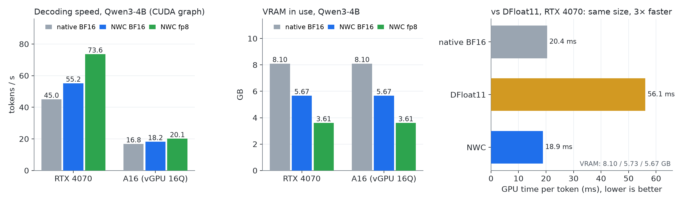
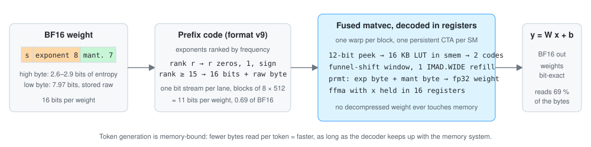

<div align="center">

# NWC · Neural Weight Compression

**Lossless compression of LLM weights, decoded inside the CUDA matvec.**
BF16 models: 31 % smaller and faster than cuBLAS. fp8 models: 13 % smaller at native fp8 speed.
Bit-identical weights either way, no extra quantization.

[](https://pypi.org/project/neural-weight-compression/)
[](https://pypi.org/project/neural-weight-compression/)
[](https://github.com/parda21/NWC/actions/workflows/ci.yml)
[](https://huggingface.co/Parda21/Qwen3-4B-NWC)
[](https://huggingface.co/Parda21/Qwen3-4B-NWC-fp8)
[](LICENSE)

[Quickstart](#quickstart) · [Results](#results) · [How it works](#how-it-works) · [Hardware](#hardware) · [Roadmap](#roadmap) · [FAQ](#faq) · [For agents](#for-agents)

</div>



Token generation is memory-bound: every weight is read once per token. NWC stores the weights entropy-coded
in VRAM and decodes them in registers, inside the matrix-vector kernel, so no decompressed weight ever touches
memory and the GPU reads fewer bytes per token.

- **BF16** (the checkpoint as published, no quantization): 69 % of the bytes. Qwen3-4B on an RTX 4070 runs
  **22 % faster** than native BF16 in **2.4 GB less VRAM**; on a bandwidth-starved NVIDIA A16 it is still faster.
  Qwen2.5-7B in full BF16 fits a 12 GB card.
- **fp8** (weight-only e4m3, the format serving stacks use): the fp8 values stored lossless at 87 % of their bytes.
  Qwen3-4B in **3.61 GB** at **73.6 tokens/s** on the 4070, the speed of a native fp8 matvec.
- **int8**: measured, not built. Its symbols are nearly incompressible (5 % with this coder, 13 % with an ideal one).

## News

- **main** · tensor-core accumulation layout (format v10, opt-in `layout=1`): fp8 kernels on the A16 9–13 % faster, at parity on the 4070; v9 checkpoints keep loading ([docs/results.md](docs/results.md), section 9).
- **main** · fp8: weight-only fp8 e4m3 models (per-channel scale) with the fp8 values stored lossless, 0.87 of the
  fp8 size, same speed as a native fp8 matvec on the RTX 4070 and 1.2–2.1× cuBLAS BF16 (`--fp8` in the demo,
  `convert(model, elem="fp8")`; [docs/results.md](docs/results.md), section 8).
- **2026-09-19** · v0.9.1: `python -m nwc.doctor` environment check, `export_bf16` back to plain checkpoints,
  Hugging Face repo ids in `load_pretrained` and the demo, kernels built for Turing (sm_75), CI, and a
  [0.6B smoke-test checkpoint](https://huggingface.co/Parda21/Qwen3-0.6B-NWC).
- **2026-09-16** · v0.9.0: format v9 (prefix code + lookup table) reaches parity on the A16, any matrix shape,
  [PyPI package](https://pypi.org/project/neural-weight-compression/) and the
  [Qwen3-4B checkpoint](https://huggingface.co/Parda21/Qwen3-4B-NWC).

## Quickstart

Needs an NVIDIA GPU (Turing or newer, Ampere or newer measured), a driver for CUDA 12.6+ and PyTorch with CUDA.

```bash
pip install neural-weight-compression transformers accelerate
python -m nwc.doctor                                          # GPU, driver, library, kernel round trip: all ok?
python -m nwc.demo Parda21/Qwen3-0.6B-NWC --load --graph      # 1 minute, 0.8 GB download: does everything run?
python -m nwc.demo Parda21/Qwen3-4B-NWC --load --graph        # 5.6 GB: lossless BF16, the model the numbers above are from
python -m nwc.demo Parda21/Qwen3-4B-NWC-fp8 --load --graph    # 3.5 GB: weight-only fp8, fp8 values lossless
python -m nwc.demo Qwen/Qwen3-4B --native --graph             # the same model uncompressed, for comparison
```

The demo prints VRAM in use, the generated text and tokens/s, once through HF `generate` and once as a CUDA
graph (no Python overhead). `--save DIR` writes a compressed checkpoint of any BF16 model you pass it.

```python
from nwc import fuse, convert, save_pretrained, load_pretrained, export_bf16

fuse(model); convert(model)                             # any HF causal LM in BF16: nn.Linear -> NWCLinear, on the GPU
save_pretrained(model, "my-model-NWC", tokenizer=tok)   # compressed checkpoint (safetensors + nwc_config.json)
model = load_pretrained("my-model-NWC")                 # or a HF repo id; no BF16 originals needed
export_bf16("my-model-NWC", "my-model")                 # back to a plain BF16 checkpoint, bit-identical
```

The converted model is a normal Transformers model: `generate`, chat templates, `StaticCache` and CUDA graphs all
work. Batch 1 runs through the fused kernel; prefill dequantizes into a temporary buffer and calls cuBLAS.
`convert(model, elem="fp8")` (demo: `--fp8`) quantizes to weight-only fp8 e4m3 first and stores the fp8 values
lossless: Qwen3-4B in 3.61 GB of VRAM at 73.6 tokens/s on the RTX 4070 (native BF16: 8.10 GB, 45 tokens/s), the
kernel as fast as a native fp8 matvec. Ready-made: [Parda21/Qwen3-4B-NWC-fp8](https://huggingface.co/Parda21/Qwen3-4B-NWC-fp8).

## Results

Qwen3-4B, greedy decoding as a CUDA graph, same tokens as the reference (64/64). Full tables, the cost model and
the negative results are in [docs/results.md](docs/results.md).

| | RTX 4070 (452 GB/s) | NVIDIA A16 (vGPU 16Q, 10 SMs, 165 GB/s) |
|---|---|---|
| VRAM, native BF16 → NWC | 8.10 GB → **5.67 GB** | 8.10 GB → **5.67 GB** |
| tokens/s, native → NWC | 45 → **55** (1.22×) | 16.8 → **18.2** (1.08×) |
| GPU time per token, native → NWC | 20.4 ms → **18.9 ms** | 54.1 ms → **52.1 ms** |
| weight kernels vs cuBLAS, 5 layer shapes | 1.17–1.55× | 1.06–1.18× |
| logits vs native | bit-identical | within cuBLAS' own cross-GPU spread (max 0.20, argmax identical) |

Against [DFloat11](https://github.com/LeanModels/DFloat11) (NeurIPS 2025), which compresses the same exponent
bits with Huffman coding but decodes into a buffer before the matmul. Same model, same GPU, GPU time per token
by `torch.profiler` ([scripts/compare_df11.py](scripts/compare_df11.py)):

| RTX 4070 | native BF16 | DFloat11 | NWC |
|---|---|---|---|
| VRAM | 8.10 GB | 5.73 GB | **5.67 GB** |
| GPU time per token | 20.4 ms | 56.1 ms (2.74× native) | **18.9 ms** (0.93× native) |
| weight kernels per token | gemv 17.2 ms | decode 36.6 + gemv 16.2 ms | **17.3 ms**, decode fused |

Same size, opposite speed: DFloat11's decoded weights pass through memory twice, NWC reads only the compressed
bytes. Both land at the entropy of the mantissa; the choice of coder moves the size by 1–2 %.

**fp8.** `convert(model, elem="fp8")` quantizes to weight-only fp8 e4m3 (per-channel scale, activations BF16, the
recipe vLLM & co. serve) and stores the fp8 values lossless. Qwen3-4B, CUDA graph, greedy; the baseline is the
library's own fp8 weight-only matvec, which reads one byte per weight at the memory bandwidth
([docs/results.md](docs/results.md), section 8):

| Qwen3-4B | native BF16 | native fp8 (uncompressed) | **NWC fp8** |
|---|---|---|---|
| VRAM, RTX 4070 | 8.10 GB | 4.44 GB¹ | **3.61 GB** |
| tokens/s, RTX 4070 | 45 | 75.0 | **73.6** |
| tokens/s, NVIDIA A16 | 16.8 | 25.8 | **20.1** (21.7 with `layout=1`) |
| weight kernels vs native fp8 matvec | | 1× | 4070: 0.85–1.09× · A16: 0.70× (0.80× with `layout=1`) |
| bytes per weight | 2 | 1 | **0.87** |
| perplexity WikiText-2 | 18.03 | 18.15 | 18.15 (the fp8 quantization; NWC changes nothing) |

¹ `python -m nwc.demo MODEL --native-fp8`: the same quantization served uncompressed by the library's reference
fp8 matvec; its tied `lm_head` stays BF16, hence the extra VRAM. An external baseline (vLLM fp8) is
[#10](https://github.com/parda21/NWC/issues/10).

int8 was measured and not built: its symbol alphabet is flat, the prefix code would save 5 %, an ideal coder 13 %
(section 7 there).

## How it works



- **Byte planes.** A BF16 weight is split into its mantissa byte (7.97 bits of entropy, stored raw) and its
  exponent/sign byte (2.6–2.9 bits of entropy, entropy-coded). That is where the 31 % come from; ZipNN and
  DFloat11 land at the same figure because it is the entropy of the data.
- **Prefix code instead of rANS (format v9).** Exponents are ranked by frequency and written as a unary rank code
  plus a raw sign bit, with an escape for rare values. A 12-bit peek into a 16 KB lookup table in shared memory
  yields two complete codes per step; the bit window is advanced with funnel shifts and refilled with a single
  wide multiply-add. Measured on the A16: 11–13 SM clocks per 64 weights, below the 13.6 needed to match cuBLAS.
- **Fused kernel.** One persistent block per SM; each lane decodes its own bit stream for a block of 8 rows × 512
  columns, keeps its 16 activations in registers and accumulates eight row sums; a transposed shuffle reduction
  writes partial sums per (row, column block). Any matrix shape works (padding costs 2 bits per filler weight).
- **Dequantization and embedding lookup** (tied `lm_head`) run on the same decoder.

The format is specified in [docs/format.md](docs/format.md) and reproduced by a pure-Python reference decoder in
[tests/test_format_cpu.py](tests/test_format_cpu.py).

## Hardware

Whether NWC beats native depends on decoder throughput versus memory bandwidth × 0.69 (see
[docs/results.md](docs/results.md), section 3). Measured rows are ours; projected rows assume Ampere issue rates.

| GPU | status | weight kernels vs cuBLAS | Qwen3-4B tokens/s, native → NWC |
|---|---|---|---|
| RTX 4070 | ✅ measured | 1.17–1.55× | 45 → 55 |
| NVIDIA A16 (vGPU 16Q) | ✅ measured | 1.06–1.18× | 16.8 → 18.2 |
| RTX 4080 Super | ⏳ next (in house) | ~1.4× projected | |
| H100 PCIe | 🔍 wanted | ~1.1–1.2× projected | |
| H100 SXM | 🔍 wanted | ~0.8–0.9× projected, tensor-core path planned | |
| A100 | 🔍 wanted | ~0.9× projected | |
| RTX 4090 / 3090 / 30xx | 🔍 wanted | bandwidth-bound, > 1× expected | |
| T4 / RTX 20xx (Turing) | 🔧 builds (sm_75), unmeasured | | |
| Blackwell (sm_100/120) | 🔧 PTX JIT on Linux, sm_120 built on Windows, unmeasured | | |

**Have one of the wanted GPUs?** Two commands and the output in a
[benchmark issue](https://github.com/parda21/NWC/issues/new?template=benchmark_result.yml) puts your card in this
table:

```bash
python -m nwc.demo Parda21/Qwen3-4B-NWC --load --graph && python -m nwc.demo Qwen/Qwen3-4B --native --graph
```

## Roadmap

Tracked in [milestones](https://github.com/parda21/NWC/milestones) and
[roadmap issues](https://github.com/parda21/NWC/issues?q=is%3Aissue+label%3Aroadmap).

- [x] v0.9 · format v9, A16 parity, shape-independent, PyPI wheels (Windows, Linux), HF checkpoints, CI
- [x] v0.10 · fp8 weight-only element type (fp8 values lossless, 0.87 of fp8 size, native-fp8 speed on Ada)
- [ ] v0.10 · measure RTX 4080 Super ([#1](https://github.com/parda21/NWC/issues/1)) and H100 ([#2](https://github.com/parda21/NWC/issues/2)); community results into the hardware table ([#8](https://github.com/parda21/NWC/issues/8))
- [x] v0.10 · tensor-core accumulation layout (`mma.m16n8k16`): built and measured ([#3](https://github.com/parda21/NWC/issues/3)); fp8 on the A16 +9–13 %, BF16 at parity, so the H100 question stays open and moves to wider stream refills
- [ ] v0.10 · why does Ada need 17 SM clocks per warp step where Ampere needs 11? (same SASS; docs/results.md section 8)
- [ ] v0.10 · second model family (Llama 3.1 8B, Mistral) with perplexity check ([#4](https://github.com/parda21/NWC/issues/4)); Colab notebook on a T4 ([#5](https://github.com/parda21/NWC/issues/5))
- [ ] v1.0 · llama.cpp port (GGML tensor type, CUDA mmv kernel, converter), the road to Ollama / LM Studio ([#6](https://github.com/parda21/NWC/issues/6))
- [ ] v1.0 · paper, draft in `docs/paper/` ([#7](https://github.com/parda21/NWC/issues/7))

## FAQ

**Can I run the checkpoint in LM Studio, Ollama or llama.cpp?** Not yet. An NWC checkpoint is read by
`nwc.load_pretrained` (PyTorch + Transformers). llama.cpp has no NWC tensor type; that port is on the roadmap
and is what Ollama and LM Studio would need. vLLM, TGI and SGLang have no loader either.

**Do I need NWC to use the model?** Only while it is compressed. `python -m nwc.export CHECKPOINT OUT` gives you
the original BF16 checkpoint back, bit for bit, and from there every tool works as usual. There is no lock-in.

**Is it really lossless?** Yes. Dequantized weights equal the originals (`torch.equal`, tested on every commit for
the format and on the GPU before releases). Only the fp32 summation order of the matvec differs from cuBLAS, the
same way cuBLAS differs between two GPUs.

**Does it make prefill or batched inference faster?** No. Batch 1 (token generation) is the fast path; prefill
dequantizes into a temporary BF16 buffer and calls cuBLAS, so it only saves memory.

**What about int8 / fp8 models?** fp8 e4m3 weight-only is supported (`elem="fp8"`): the fp8 values are stored
lossless at 0.87 of their size, decoded by the same kernel, at native-fp8 speed on the 4070 (0.7× on the A16,
where the decoder is the limit). int8 was measured and not built: its symbol alphabet is flat, the prefix code
would save only 5 %, an ideal coder 13 %. Numbers in [docs/results.md](docs/results.md), sections 7 and 8.

**Which models work?** Any HF causal LM in BF16; the encoder only needs the weights. Tested: Qwen2.5 (3B, 7B),
Qwen3 (0.6B, 4B). Small models (0.6B) save memory but are not faster: their matrices are launch-bound.

**My GPU is not in the table.** Run it and tell us. Turing builds but is unmeasured; Blackwell runs via PTX JIT.

**Something fails.** `python -m nwc.doctor` first; paste its output into a
[bug report](https://github.com/parda21/NWC/issues/new?template=bug_report.yml).

## Install from source

```bash
git clone https://github.com/parda21/NWC && cd NWC
python -m nwc.build                 # fatbin sm_75..sm_90 + PTX into nwc/lib (needs nvcc 12.6+; 13.x on Windows)
pip install -e .
```

Repository builds for the local GPU only: `.\build.ps1` (Windows, Visual Studio 2022 Build Tools) or
`./build.sh sm_86` (Linux) write `build/nwc_ops.dll|so`, which the tests and scripts pick up.

```bash
python tests/test_format_cpu.py      # no GPU: reference decoder, bit-exact
python scripts/make_wraw.py          # test matrix data/W.raw from a local model
python tests/test_k.py               # GPU: dequantization bit-exact, token path, fp32 path, odd shapes
python tests/test_gather.py          # GPU: embedding lookup
python tests/test_checkpoint.py      # GPU: save -> load -> export round trip, no download
python scripts/kernbench.py --runs 30                              # kernel vs cuBLAS per layer shape
python scripts/graph_decode.py --mode nwc --fusion --tokens 256    # tokens/s as a CUDA graph, vs HF generate
```

```
csrc/nwc_ops.cu   the kernel library: encoder, fused matvec, dequantization, gather
nwc/              Python package: nwc_torch (NWCLinear, convert, fuse), checkpoint (save/load/export), demo, doctor, build
tests/ scripts/   correctness tests; benchmarks the numbers above come from
docs/             results.md, format.md, model cards, paper/, announce.md
experiments/      kernel iterations v1–v9, micro-benchmarks, earlier formats: history, not product
```

## For agents

[AGENTS.md](AGENTS.md) is the rule book for coding agents (and humans): repository map, which tests need a GPU and
which do not, how kernel changes are measured, the conventions, and the pitfalls we already hit. A `CLAUDE.md`
points there. `tests/test_format_cpu.py` lets an agent without a GPU verify the format bit-exactly.

## Contributing, citing, sponsor, license

Contributions: see [CONTRIBUTING.md](CONTRIBUTING.md); benchmark results from GPUs we do not have are the most
useful thing right now. Cite with the [CITATION.cff](CITATION.cff) (GitHub's "Cite this repository" button).
This project is sponsored by [cloo GmbH](https://github.com/cloogmbh). Apache License 2.0, Copyright 2026 Paul
Otto, see [LICENSE](LICENSE).

**About this project.** Was it created with the help of AI? Yes. Do I care, as long as it works? No.
